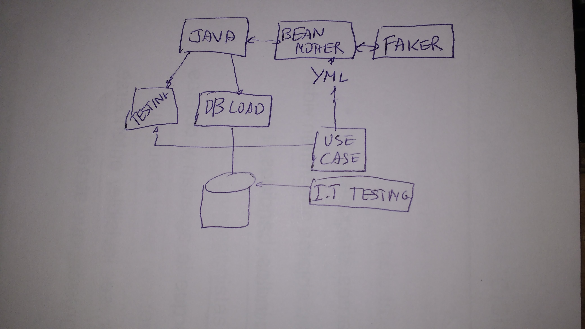
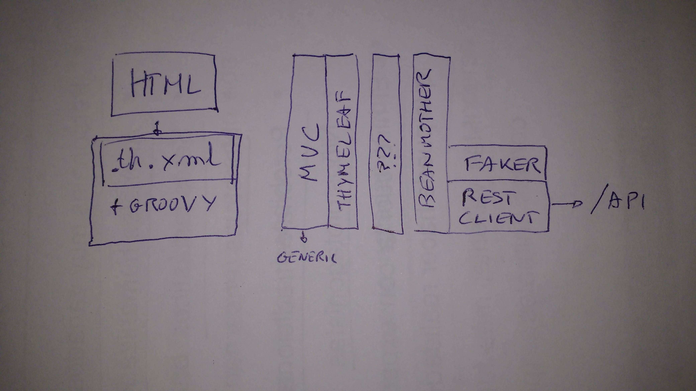

# thymemother
A "bean mother pattern" for the Thymeleaf templates.

## BeanMother
When I discover [Beanmother](http://beanmother.io) I thought it could be a good "testing purpose" library..



to build "object" for junit test, build it from yml... and too, for load the database.​

## The idea
The current project came from my frontend experience...



In my [blog](https://josejuanmontiel.github.io/blog/2016/10/groovy-thymelaf.es.html), few years ago, I start to think about. Now, the idea it's "extend" beanmother for "build the objects" from an API REST, and do "spring mvc+thymeleaf+generic controller" + groovy library to put "html+th.xml" for rapid HTML prototyping.

The project could be execute by:

java -jar thymemother.jar -Dpathtohtml=xxx -Dport=8080 -Dfixture=yyy

then you can open in browser http://localhost:8080/template1 and render template1.html+th.xml or the "groovy version" where bind the model with beanmother objects.

## Evolution of BeanMother 
You could think how to make a dinamic rest client in a new module of beanmother where witha fixture like this

```YAML
apiuser: &apiuser
  rest.url: http://rest/api/method?$1
  rest.method: POST
  rest.param: {"param1":"value1","param2":$2}
  
  name: response.param_name
  type: response.param_type
  other: ${faker.book.title}

users: &users
    - <<: *apiuser?value1&value2
    - <<: *apiuser?value3&value4
    - <<: *apiuser?value5&value6
```

Evolving the fixture to indicate the url of the rest and the params, and where attribute of the "beanmother fixture" to bind the response, the project can instantiate this object with the date returned by the rest client...

Using this thymeleaf decouple groovy:

```JSON
thlogic {
    attr(sel:'#usersTable', 'th:remove':'all-but-first') {
        attr(sel:'/tr[0]', 'th:each':'user : ${users}') {
            attr(sel:'td.username', 'th:text':'${user.name}')
            attr(sel:'td.usertype', 'th:text':'${user.type}')
        }
    }
}
```

You bind from beanmother to thymeleaf 

* TODO:
  - Review this links
    - https://github.com/josejuanmontiel/adorable-avatar
    - https://github.com/josejuanmontiel/dynamic-rest-template


